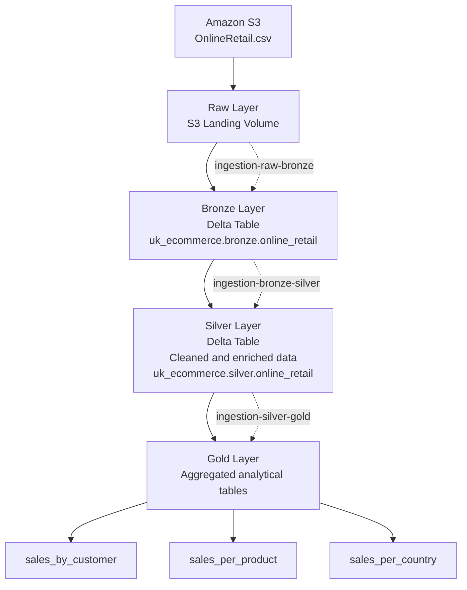
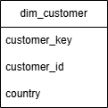
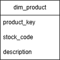
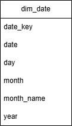
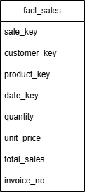
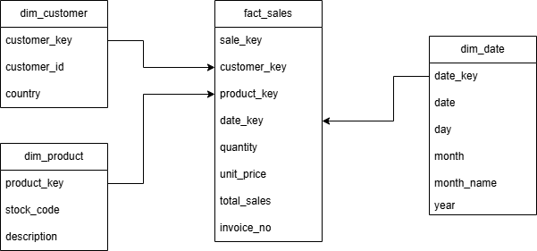
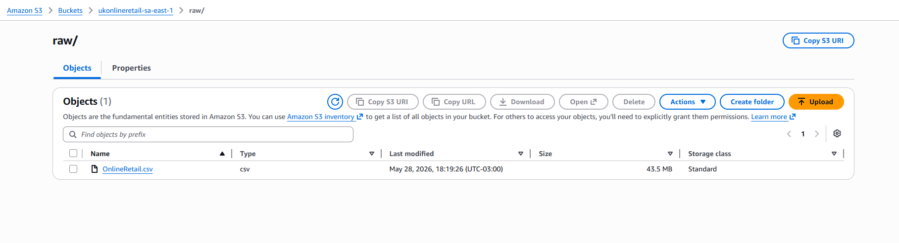
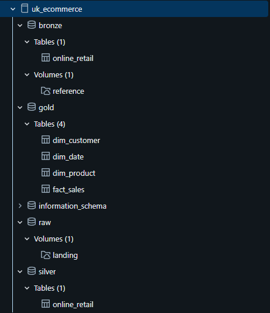

# 🛒 UK Online Retail — Data Pipeline with Medallion Architecture

Data engineering project built on Databricks using PySpark and Amazon S3, following the Medallion Architecture (Raw → Bronze → Silver → Gold). The project also includes the design of a dimensional model to support analytical workloads.

---

## 🗂️ Dataset

The dataset used is **OnlineRetail.csv**, a public dataset of real e-commerce transactions from the United Kingdom, containing information such as invoice number, product code and description, quantity, date, unit price, customer, and country.

---

## 💼 Business Understanding

1. What is the main business process represented by the dataset?  
The primary business process represented in the dataset is the sale of products to customers, recorded through purchase transactions.

2. What does a sale represent in this context?  
A sale represents a commercial transaction in which a customer purchases one or more products. In the dataset, each sale is identified by an InvoiceNo and may contain multiple invoice line items. Records whose InvoiceNo begins with the letter "C" indicate cancellations and, therefore, do not represent completed sales.

3. What should the granularity of the fact table be?  
The granularity of the fact table is at the invoice line item level. Each record represents a specific product sold within a transaction (InvoiceNo), including attributes such as quantity sold and unit price.
---

## 📐 Fact Table Granularity

The choice to have each record in the fact table represent one invoice line item is based on the fact that this is the lowest level of granularity available in the dataset. This approach preserves all transaction details, enabling future aggregations at different levels, such as by customer, product, country, or transaction, without losing information.

---

## 🏗️ Architecture



---

## 📊 Data Model

The dimensional model is designed to support analytical queries by organizing descriptive information into dimensions. Each dimension provides business context for the fact table while reducing data redundancy and improving query performance.

---

### Customer Dimension

<p align="center">
  
</p>

The `dim_customer` table stores descriptive information about customers and provides customer context for analytical queries.

#### Attributes

| Column         | Description                                  |
| -------------- | -------------------------------------------- |
| `customer_key` | Surrogate key generated for the dimension.   |
| `customer_id`  | Customer identifier from the source dataset. |
| `country`      | Customer's country.                          |

#### Modeling Decisions

The original dataset contains only two customer-related attributes: `CustomerID` and `Country`. Since `Country` provides valuable geographical context, it was incorporated into the customer dimension to enable analyses such as sales by country and customer distribution without requiring additional transformations.

---

### Product Dimension

<p align="center">
  
</p>

The `dim_product` table stores descriptive information about the products available in the dataset.

#### Attributes

| Column        | Description                                 |
| ------------- | ------------------------------------------- |
| `product_key` | Surrogate key generated for the dimension.  |
| `stock_code`  | Product identifier from the source dataset. |
| `description` | Product description.                        |

#### Data Quality Analysis

After removing null and duplicate records from the dataset, an exploratory analysis identified **213 `StockCode` values** associated with multiple product descriptions.

The inconsistencies include:

* Minor differences in formatting or wording.
* Possible historical changes in product descriptions.
* Descriptions that differ significantly, making it impossible to determine whether they refer to the same product or different products.

Since the dataset does not provide a master product reference, no automatic standardization was applied. The original descriptions were preserved to avoid introducing assumptions into the dimensional model.

---

### Date Dimension

<p align="center">
  
</p>

The `dim_date` table stores calendar attributes used to support time-based analysis and reporting.

#### Attributes

| Column       | Description                                |
| ------------ | ------------------------------------------ |
| `date_key`   | Surrogate key generated for the dimension. |
| `date`       | Calendar date.                             |
| `day`        | Day of the month.                          |
| `month`      | Month number.                              |
| `month_name` | Month name.                                |
| `year`       | Calendar year.                             |

#### Why Pre-compute a Date Dimension?

Unlike transactional data, calendar dates exist independently of business events. Therefore, the date dimension can be generated in advance rather than being created dynamically during data ingestion.

Pre-computing the date dimension simplifies analytical queries, ensures consistency across reports, and allows complete time-series analysis, including dates without recorded sales.

---

### Fact Table
<p align="center">
  
</p>

| Column       | Description                                      |
|--------------|--------------------------------------------------|
|`sale_key`    |Surrogate Key (PK)                                |
|`customer_key`|Foreign Key (FK) to `dim_customer`                |
|`product_key` |Foreign Key (FK) to `dim_product`                 |
|`date_key`    |Foreign Key (FK) to `dim_date`                    |
|`quantity`    |Quantities of each product (item) per transaction |
|`unit_price`  |Unit price of the product                         |
|`total_sales` |Total sales amount (`quantity * unit_price`)      |
|`invoice_no`  |6-digit identifier assigned to each transaction   |

---

### Star Schema
<p align="center">
  
</p>

The star schema connects the `fact_sales` table with the dimensional tables used to describe each sales transaction.

---

## 🔄 Pipeline Steps

### 1. Raw → Bronze (`ingestion-raw-bronze`)

Reads the CSV stored in the S3 volume (`/Volumes/uk_ecommerce/raw/landing/OnlineRetail.csv`) and persists it as a Delta Table in the Bronze schema.

- CSV reading with schema inference (`inferSchema=True`)
- Cast of the `CustomerID` column to `string`
- Write to `uk_ecommerce.bronze.online_retail`

### 2. Bronze → Silver (`ingestion-bronze-silver`)

Cleaning and transformation of the raw data.

- Removal of duplicate records (`dropDuplicates`)
- Removal of null values (`dropna`)
- Creation of the calculated column `totalSales` (`Quantity * UnitPrice`)
- Parsing and normalization of the `InvoiceDate` column to `DateType`
- Write to `uk_ecommerce.silver.online_retail`

### 3. Silver → Gold (`ingestion-silver-gold`)

Calculation of aggregated metrics for business analysis.

| Gold Table | Description | Columns |
|---|---|---|
| `sales_by_customer` | Totals per customer | `TotalSales`, `TotalPurchases`, `AveragePurchase` |
| `sales_per_product` | Totals per product | `TotalSales`, `TotalQuantity` |
| `sales_per_country` | Totals per country | `TotalSales`, `TotalQuantity` |

---

## 🛠️ Stack

| Tool | Usage |
|---|---|
| **Databricks** | Notebook execution environment |
| **PySpark** | Distributed data processing |
| **Delta Lake** | Table storage format |
| **Amazon S3** | Source file storage (landing zone) |

---

## 📂 Project Structure

```text
uk-online-retail/
├── assets/
│   ├── architecture/
│   └── diagrams/
│       ├── pngs/
│       └── drawio/
├── notebooks/
│   ├── ingestion-raw-bronze.ipynb
│   ├── ingestion-bronze-silver.ipynb
│   └── ingestion-silver-gold.ipynb
├── warehouse/
│   ├── diagrams/
│   └── dimensions/
└── README.md
```

---

## 🚀 Implementation

### Amazon S3 Landing Zone

<p align="center">
  
</p>

The original `OnlineRetail.csv` dataset is stored in an Amazon S3 bucket, which serves as the landing zone for the ingestion pipeline. From this location, the data is accessed by Databricks and loaded into the Raw layer before progressing through the Medallion Architecture.

### Unity Catalog Structure

<p align="center">
  
</p>

The project is organized in the Databricks Unity Catalog following the Medallion Architecture. The catalog contains the Raw, Bronze, Silver, and Gold schemas, where each layer represents a different stage of data processing—from raw ingestion to business-ready analytical tables.

---

## 🚧 Future Improvements

The project will continue to evolve with the following enhancements:

- Implement the dimension tables in SQL on Databricks.
- Implement the `fact_sales` table in SQL on Databricks.
