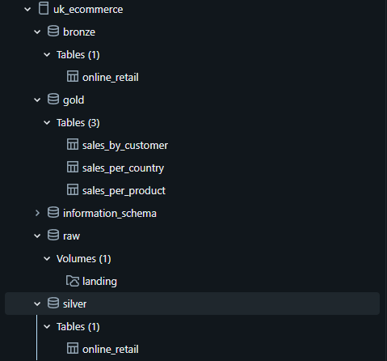

# 🛒 UK Online Retail — Data Pipeline with Medallion Architecture

Data pipeline built on **Databricks** with **PySpark** and storage on **Amazon S3**, following the medallion architecture (Raw → Bronze → Silver → Gold) to process sales data from a UK-based online retail store.

---

## 🗂️ Dataset

The dataset used is **OnlineRetail.csv**, a public dataset of real e-commerce transactions from the United Kingdom, containing information such as invoice number, product code and description, quantity, date, unit price, customer, and country.

---

## 🏗️ Architecture

```
S3 (OnlineRetail.csv)
        │
        ▼
┌──────────────┐
│  Raw (S3)    │  Landing volume on S3
└──────┬───────┘
       │  ingestion-raw-bronze
       ▼
┌──────────────┐
│   Bronze     │  Delta Table — raw data, type casting only
└──────┬───────┘
       │  ingestion-bronze-silver
       ▼
┌──────────────┐
│   Silver     │  Delta Table — cleaned and enriched data
└──────┬───────┘
       │  ingestion-silver-gold
       ▼
┌──────────────────────────────────────┐
│               Gold                   │
│  sales_by_customer                   │
│  sales_per_product                   │
│  sales_per_country                   │
└──────────────────────────────────────┘
```

## 📂 Project Structure

```
uk-online-retail/
├── notebooks/
│   ├── ingestion-raw-bronze.ipynb    # Raw → Bronze
│   ├── ingestion-bronze-silver.ipynb # Bronze → Silver
│   └── ingestion-silver-gold.ipynb   # Silver → Gold
└── README.md
```

---

## 🔄 Pipeline Steps

### 1. Raw → Bronze (`ingestion-raw-bronze`)

Reads the CSV stored in the S3 volume (`/Volumes/uk_ecommerce/raw/landing/OnlineRetail.csv`) and persists it as a Delta Table in the Bronze schema.

- CSV reading with schema inference (`inferSchema=True`)
- Cast of the `CustomerID` column to `string`
- Write to `uk_ecommerce.bronze.online_retail`

### 2. Bronze → Silver (`ingestion-bronze-silver`)

Cleaning and transformation of the raw data.

- Duplicate removal (`dropDuplicates`)
- Null removal (`dropna`)
- Creation of the calculated column `totalSales` (`Quantity * UnitPrice`)
- Parsing and normalization of the `InvoiceDate` column to `DateType`
- Write to `uk_ecommerce.silver.online_retail`

### 3. Silver → Gold (`ingestion-silver-gold`)

Calculation of aggregated metrics for business analysis.

| Gold Table | Description | Columns |
|---|---|---|
| `sales_by_customer` | Totals per customer | `TotalSales`, `TotalPurchases`, `AveragePurchase` |
| `sales_per_product` | Totals per product | `TotalSales`, `TotalQuantity` |
| `sales_per_country` | Totals per country | `TotalSales`, `TotalQuantity` |

---

## 🛠️ Stack

| Tool | Usage |
|---|---|
| **Databricks** | Notebook execution environment |
| **PySpark** | Distributed data processing |
| **Delta Lake** | Table storage format |
| **Amazon S3** | Source file storage (landing zone) |

---

## 🗄️ Unity Catalog

The project uses the following catalog and schemas in the Databricks Unity Catalog:

```
uk_ecommerce/
├── raw/          # S3 volume with the original CSV
├── bronze/       # Delta Table with raw data
├── silver/       # Delta Table with cleaned data
└── gold/         # Delta Tables with aggregated metrics
```
---

## 📸 Screenshots

### S3 Landing Zone


### Databricks Unity Catalog

